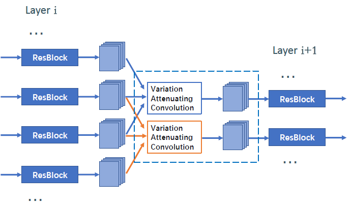
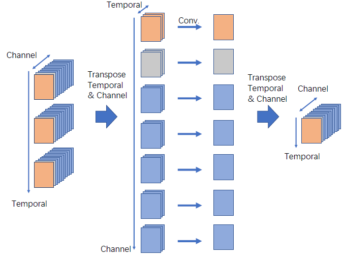

# 2D-Progressive-Fusion-Module-for-Action-Recognition
## Overview
We release the PyTorch code of [2DPF](https://www.sciencedirect.com/science/article/abs/pii/S0262885621000275).




The code is majorly based on [TSM](https://github.com/mit-han-lab/temporal-shift-module). 

**2D Progressive Fusion (2DPF) Module** is a sliding window without padding operation designed for spatiotemporal fusion, see the figure above. 

The essential component of the module is a novel convolution named **Variation Attenuating Convolution**, demonstrated in the figure below:





2DPF is designed for the conditions of irregular (small scale, long tail distribution etc.) data and limited computing resource, the super parameters for network training / testing is insensitive and fixed.

The data pre-processing majorly follow the settings of [TSM](https://github.com/mit-han-lab/temporal-shift-module).

## Prerequisites
The code is built with following libraries:

- [PyTorch](https://pytorch.org/) 1.5.0 or higher
- [TensorboardX](https://github.com/lanpa/tensorboardX)
- [tqdm](https://github.com/tqdm/tqdm.git)
- [scikit-learn](https://scikit-learn.org/stable/)

## Training & Testing
```training.sh``` and ```testing.sh``` is provided for training and testing.

Pathway fusion is proposed to further extend the modeling capability for large scale datasets. We flexibly adjust the network configurations to create pathways. Please copy the pathway models to ```./fusion_validation``` for the usage.

## Citation
```
@article{shen20212d,
  title={2D progressive fusion module for action recognition},
  author={Shen, Zhongwei and Wu, Xiao-Jun and Kittler, Josef},
  journal={Image and Vision Computing},
  volume={109},
  pages={104122},
  year={2021},
  publisher={Elsevier}
```
